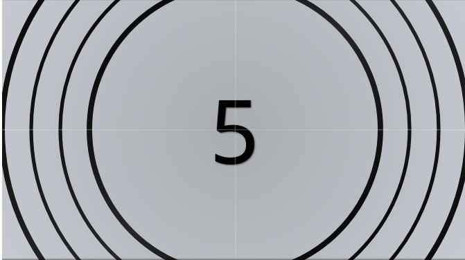

# svelte-film-countdown

A vintage-style film countdown component for your Svelte 5 applications, built with runes.



## Features

*   **Vintage Aesthetic:**  Provides a visually appealing retro film countdown experience.
*   **Highly Customizable:**  Control duration, initial count, styling, and more through props and CSS variables.
*   **External Control:**  Start, pause, resume, and reset the countdown programmatically.
*   **Callback Functions:**  Trigger actions when the countdown completes or after each count.
*   **Looping Option:**  Continuously loop the countdown.
*   **CSS Variable Theming:**  Easily customize the appearance using CSS variables.
*   **Custom Content Slot:** Add your own content within the countdown container.

## Installation

You can install `svelte-film-countdown` using npm or yarn:

```bash
npm install svelte-film-countdown
```

```bash
bun add svelte-film-countdown
```

## Usage

Import the `FilmCountdown` component into your Svelte component:

```html
<script>
  import FilmCountdown from 'svelte-film-countdown';

  let countdownInstance;

  function handleComplete() {
    alert('Countdown finished!');
  }

  function handleEachCount(currentCount) {
    console.log('Current count:', currentCount);
  }

  function startCountdown() {
    countdownInstance?.start();
  }

  function pauseCountdown() {
    countdownInstance?.pause();
  }

  function resumeCountdown() {
    countdownInstance?.resume();
  }

  function resetCountdown() {
    countdownInstance?.reset();
  }
</script>

<FilmCountdown
  bind:this={countdownInstance}
  initialCount={5}
  countdownDuration={1000}
  onComplete={handleComplete}
  onEachCount={handleEachCount}
>
  <p slot="custom-content" style="text-align: center; font-style: italic;">Get ready!</p>
</FilmCountdown>

<br />
<button onclick={startCountdown}>Start</button>
<button onclick={pauseCountdown}>Pause</button>
<button onclick={resumeCountdown}>Resume</button>
<button onclick={resetCountdown}>Reset</button>
```

### Basic Example

```html
<script>
  import FilmCountdown from 'svelte-film-countdown';
</script>

<FilmCountdown />
```

### With Custom Initial Count and Duration

```html
<script>
  import FilmCountdown from 'svelte-film-countdown';
</script>

<FilmCountdown initialCount={10} countdownDuration={500} />
```

### Using Callbacks

```html
<script>
  import FilmCountdown from 'svelte-film-countdown';

  function handleComplete() {
    console.log('Countdown finished!');
  }

  function handleEachCount(currentCount) {
    console.log('Current count:', currentCount);
  }
</script>

<FilmCountdown onComplete={handleComplete} onEachCount={handleEachCount} />
```

### Configuration Options

```html
<script>
  import FilmCountdown from 'svelte-film-countdown';
</script>

<FilmCountdown
  initialCount={3}
  config={{
    numberColor: "red",
    numCircles: 4
  }}
/>
```

### Looping Countdown

```html
<script>
  import FilmCountdown from 'svelte-film-countdown';
</script>

<FilmCountdown loop={true} />
```

> NOTE: you need to trigger the `start` manuanly

## Props

| Prop Name          | Type     | Default Value | Description                                                                         |
| ------------------ | -------- | ------------- | ----------------------------------------------------------------------------------- |
| `initialCount`     | `number` | `5`           | The starting number for the countdown.                                             |
| `countdownDuration`| `number` | `1000`        | The duration for each count in milliseconds.                                       |
| `onComplete`       | `() => void`| `() => {}`    | Callback function executed when the countdown reaches 0.                             |
| `onEachCount`      | `(count: number) => void`| `() => {}`    | Callback function executed after each count, receiving the current count as an argument. |
| `config`           | `object` | `{}`          | An object containing various configuration options. See below for details.        |
| `loop`             | `boolean`| `false`       | If `true`, the countdown will restart automatically after reaching 0.               |

### `config` Object Properties

| Property Name   | Type     | Default Value              | Description                                                                |
| --------------- | -------- | -------------------------- | -------------------------------------------------------------------------- |
| `numberColor`   | `string` | `'var(--countdown-number-color)'` | The color of the countdown number.                                  |
| `numCircles`    | `number` | `4`                        | The number of animated circles around the countdown.                       |

## Exported Functions

You can control the `FilmCountdown` component externally using these exported functions, which require you to bind a reference to the component using `bind:this`:

*   **`start()`:**  Starts the countdown.
*   **`pause()`:**  Pauses the countdown.
*   **`resume()`:** Resumes the countdown from where it was paused.
*   **`reset()`:**  Resets the countdown to its initial state.

## Theming

The appearance of the `FilmCountdown` component can be easily customized using CSS variables. You can set these variables in your global styles or within the scope of a parent component.

Here are the available CSS variables:

```css
:root {
  --countdown-number-color: black;
  --countdown-button-color: rgba(0, 0, 0, 0.8);
  --countdown-button-text-color: white;

  --film-hole-width: 20px;
  --film-hole-rect-width: 8px;
  --film-hole-rect-height: 12px;
  --film-hole-y-top: 10px;
  --film-hole-y-bottom: 22px;
  --film-hole-color: black;

  --sweeping-background-color: rgba(0, 0, 0, 0.15);

  --circle-stroke-width-thick: 3px;
  --circle-stroke-width-thin: 2px;
  --circle-gradient-start: black;
  --circle-gradient-middle: black;
  --circle-gradient-middle-opacity: 0.8;
  --circle-gradient-end: black;

  --grid-line-color: rgba(255, 255, 255, 0.3);
  --film-grain-opacity: 0.1;
  --flicker-duration: 0.15s;
  --vignette-strength: 0.4;
  --center-vignette-strength: 0.15;
  --scratch-color: rgba(255, 255, 255, 0.2);
  --scratch-opacity: 0.15;
  --number-font: monospace;
  --number-text-shadow: 1px 1px 2px rgba(0, 0, 0, 0.5);
  --film-grain-pattern: linear-gradient(to bottom, rgba(156, 163, 175, 0.05), transparent, rgba(156, 163, 175, 0.05));
}
```

**Example of Theming:**

```html
<style>
  :root {
    --countdown-number-color: lightyellow;
    --countdown-button-color: darkred;
    --countdown-button-text-color: white;
    --film-grain-opacity: 0.2;
  }
</style>

<FilmCountdown />
```

## Contributing

Contributions are welcome! Please feel free to open issues or submit pull requests for bug fixes, improvements, or new features.

## License

[MIT License](LICENSE)
